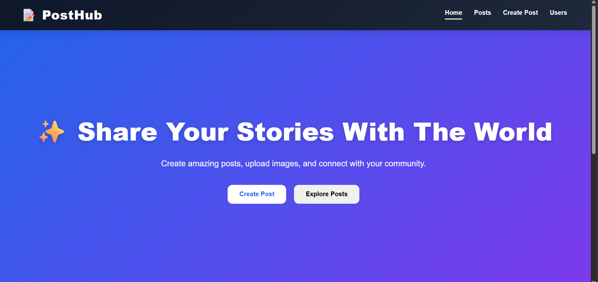
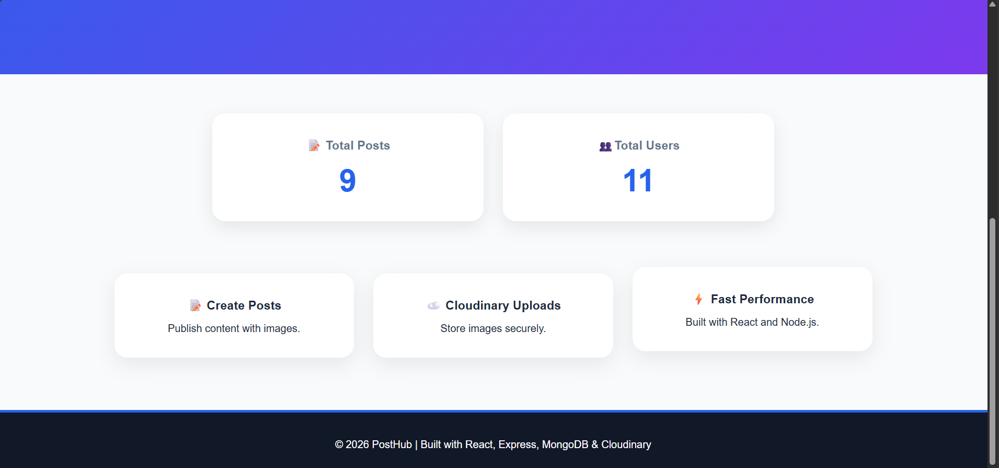
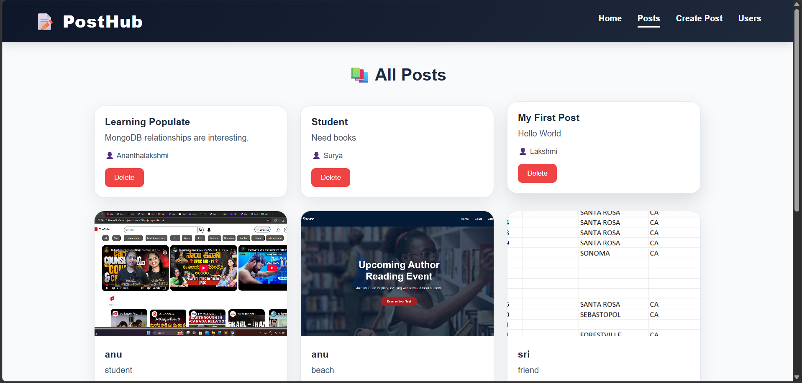
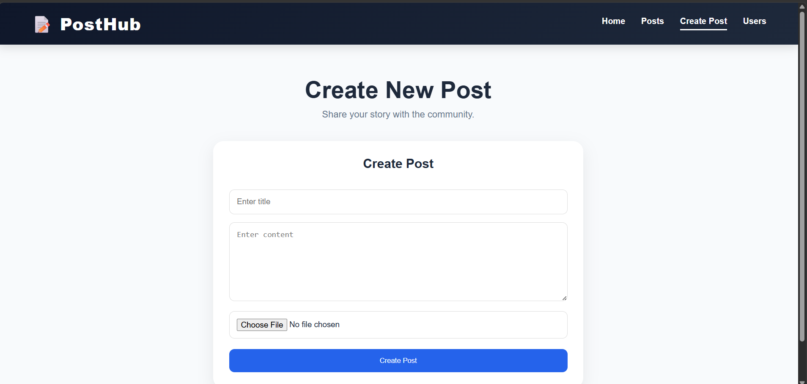
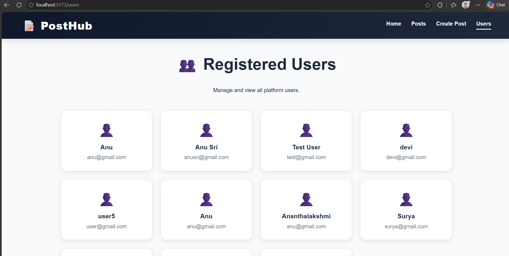

# 🚀 PostHub Frontend

A modern React-based frontend application that allows users to create, view, and manage posts through a full-stack integration with a Node.js, Express, MongoDB backend.

## 📌 Project Overview

PostHub is a full-stack blog management platform developed as part of Sprint 11 Fullstack System Integration. The application connects a React frontend with a REST API backend and MongoDB database, enabling complete CRUD functionality with image uploads.

## ✨ Features

* Modern and responsive UI
* Create new posts
* Upload images with Cloudinary
* View all posts
* Delete posts
* View registered users
* Dynamic loading states
* Error handling
* Responsive design for mobile and desktop
* Integrated with Express and MongoDB backend

## 🛠️ Tech Stack

### Frontend

* React.js
* Vite
* React Router DOM
* Axios
* CSS3

### Backend Integration

* Node.js
* Express.js
* MongoDB
* Mongoose
* Multer
* Cloudinary

## 📂 Project Structure

src/
│
├── components/
│ ├── Navbar.jsx
│ └── PostForm.jsx
│
├── pages/
│ ├── Home.jsx
│ ├── Posts.jsx
│ ├── CreatePost.jsx
│ └── Users.jsx
│
├── services/
│ └── api.js
│
├── App.jsx
└── main.jsx

## ⚙️ Installation

Clone the repository:

```bash
git clone <https://github.com/anucodeverse/PostHub-Cloudinary-App>
```

Navigate to project:

```bash
cd PostHub-Frontend
```

Install dependencies:

```bash
npm install
```

Start development server:

```bash
npm run dev
```

## 🔗 Backend Configuration

Update the API URL inside:

```javascript
src/services/api.js
```

Example:

```javascript
const API_URL = "https://blogapicluster-6two.onrender.com";
```

## 🚀 Deployment

Frontend Deployment:

* Vercel

Backend Deployment:

* Render

Database:

* MongoDB Atlas

Cloud Storage:

* Cloudinary

##  Testing Checklist

✔ Fetch posts from backend

✔ Fetch users from backend

✔ Create new posts

✔ Upload images

✔ Delete posts

✔ Data persistence after refresh

✔ Responsive UI

✔ Error handling

## 📸 Application Screenshots

###  Home Page





### 📝 Posts Page



### ➕ Create Post Page



### 👥 Users Page


## 🎯 Learning Outcomes

This project demonstrates:

* React Hooks (useState, useEffect)
* API Integration
* CRUD Operations
* React Router
* State Management
* File Upload Handling
* Cloudinary Integration
* Fullstack Application Architecture
* Deployment Workflow

## 👨‍💻 Author

Ananthalakshmi

Developed as part of the Fullstack Developer Track at ProDesk IT.


